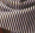
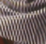

# MSRN_PyTorch
### This repository is a PyTorch version of the paper "Multi-scale Residual Network for Image Super-Resolution" (ECCV 2018).

We propose a novel multi-scale residual network (MSRN) to fully exploit the image features, which performance exceeds most of the state-of-the-art SR methods. 
Based on the residual block, we introduce convolution kernels of different sizes to adaptively detect the image features at different scales. 
Meanwhile, we let these features interact with each other to get the most effective image information. 
This structure is called Multi-scale Residual Block (MSRB), which effectively extracts the features of the image. 
Furthermore, the outputs of each MSRB are used as the hierarchical features for global feature fusion. 
And then, all these features are sent to the reconstruction module for recovery of the high-quality image. 

Paper can be found at http://openaccess.thecvf.com/content_ECCV_2018/papers/Juncheng_Li_Multi-scale_Residual_Network_ECCV_2018_paper.pdf

More SR images reconstructed by our model can be found at https://goo.gl/bGnZ8D.

      
     

### From left to right: Aplus, LapSRN, MSRN(our) and Original(GT) x2
---------------------

      
     

### From left to right: Aplus, LapSRN, MSRN(our) and Original(GT) x2
---------------------

## Prerequisites:
1. Linux
2. Python 3.5
3. PyTorch 0.4.0
3. CPU or NVIDIA GPU + CUDA CuDNN (CUDA 8.0)

## Training
	python main.py --cuda
## Testing
	python test.py --cuda   

## Dataset
We use matlab code for training data augment

### training dataset generation
      cd Data_process
      run generate_train.m
      
### test dataset generation
      cd Data_process
      run generate_test.m
      
## Example (use pretrained model x3)
     cd example
     python test.py --cuda
