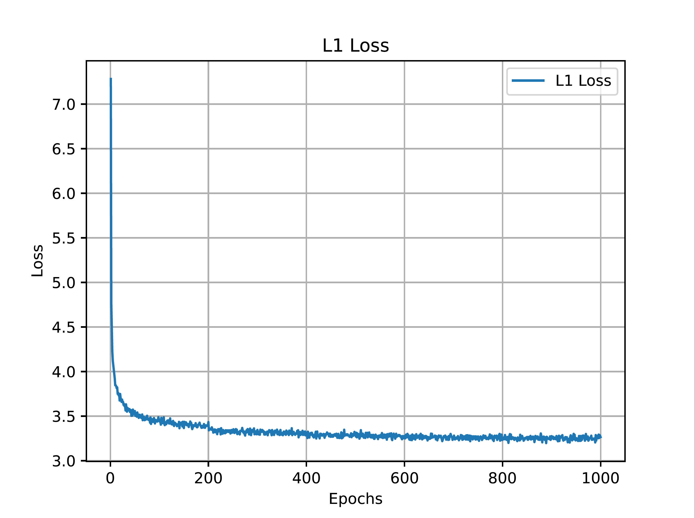
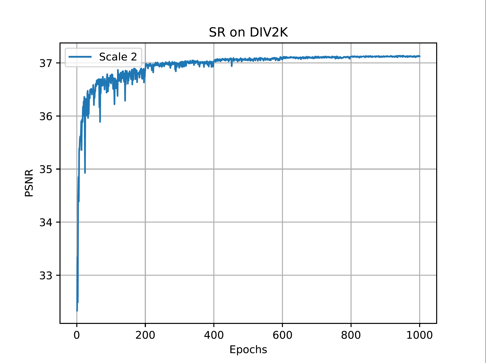
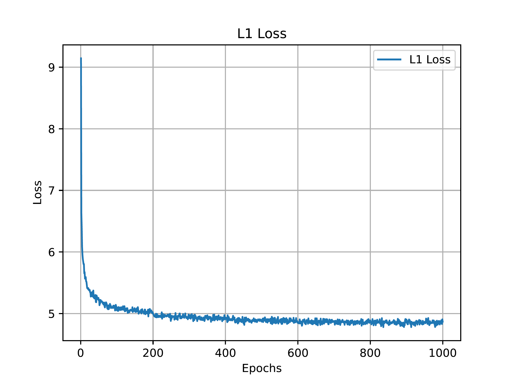
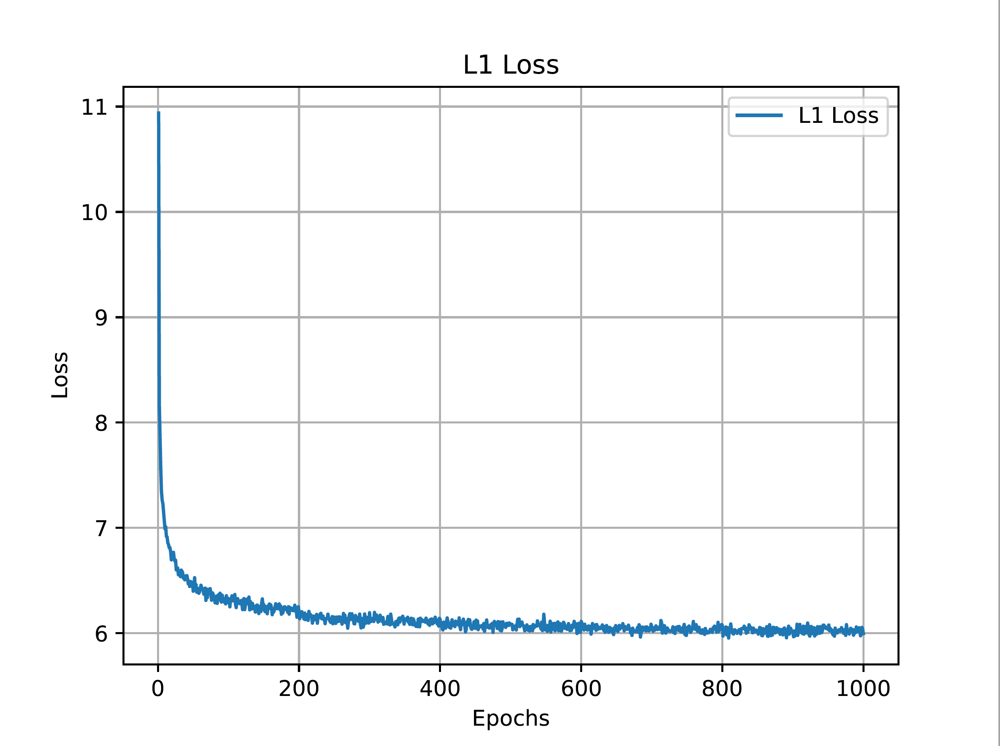

# MSRN_PyTorch
### This repository is an official PyTorch implementation of the paper "Multi-scale Residual Network for Image Super-Resolution".

Paper can be download from <a href="http://openaccess.thecvf.com/content_ECCV_2018/papers/Juncheng_Li_Multi-scale_Residual_Network_ECCV_2018_paper.pdf">MSRN</a> 

All test datasets (Preprocessed HR images) can be downloaded from <a href="https://www.jianguoyun.com/p/DcrVSz0Q19ySBxiTs4oB">here</a>.

All original test datasets (HR images) can be downloaded from <a href="https://www.jianguoyun.com/p/DaSU0L4Q19ySBxi_qJAB">here</a>.


Our MSRN was  trained and tested on the Y channel directly.
However, more and more SR models are trained on RGB channels.
For a fair comparison, we retrained MSRN based on <a href="https://github.com/thstkdgus35/EDSR-PyTorch">EDSR</a>  code.
We release the new codes and results on this project.

The old codes are moved into the OLD/ folder.
The new codes are stored on MSRN/ folder.


### Update 2019.06.12.1
The retraining model provided previously uses the DIV2K (1-895).

We corrected this error and provided retrained models (DIV2K 1-800) and results.

We also provided x8 results now!

Notice that, we only use 800 images (DIV2K 1-800) for training and use the latest weight file for the test.


### Update 2019.06.12.2


All pretrained model can be downloaded from <a href="https://www.jianguoyun.com/p/DQpSSlQQ19ySBxjH2IYB">ECCV2018_MSRN_premodel</a>  or can be found "Test/model".

All reconstructed images can be downloaded from  <a href="https://www.jianguoyun.com/p/DQW60AIQ19ySBxjD8ckB">ECCV2018_MSRN_SR_images</a> （Including MSRN and MSRN+）. 


#### At the same time, we also noticed the defect of MSRN, the improved version of MSRN will be released soon.  


--------------------

## Prerequisites:
1. Python 3.6
2. PyTorch >= 0.4.0
3. numpy
4. skimage
5. imageio
6. matplotlib
7. tqdm

For more informaiton, please refer to <a href="https://github.com/thstkdgus35/EDSR-PyTorch">EDSR</a> and <a href="https://github.com/yulunzhang/RCAN">RCAN</a>.


## Document
Train/             : all train files

Test/              : all test files

demo.sh        : all running instructions


## Dataset
We used DIV2K dataset to train our model. Please download it from <a href="https://data.vision.ee.ethz.ch/cvl/DIV2K/">here</a>  or  <a href="https://cv.snu.ac.kr/research/EDSR/DIV2K.tar">SNU_CVLab</a>.

Extract the file and put it into the Train/dataset.


## Training

Using --ext sep_reset argument on your first running.

You can skip the decoding part and use saved binaries with --ext sep argument in second time.


If you have enough memory, using --ext bin.
 
```
  cd Train/
  # MSRN x2  LR: 48 * 48  HR: 96 * 96
  python main.py --template MSRN --save MSRN_X2 --scale 2 --reset --save_results --patch_size 96 --ext sep_reset
  
  # MSRN x3  LR: 48 * 48  HR: 144 * 144
  python main.py --template MSRN --save MSRN_X3 --scale 3 --reset --save_results --patch_size 144 --ext sep_reset
  
  # MSRN x4  LR: 48 * 48  HR: 192 * 192
  python main.py --template MSRN --save MSRN_X4 --scale 4 --reset --save_results --patch_size 192 --ext sep_reset

```

## Testing
Using pre-trained model for training, all test datasets must be pretreatment by  ''Test/Prepare_TestData_HR_LR.m" and all pre-trained model should be put into "Test/model/".

```
#MSRN x2
python main.py --data_test MyImage --scale 2 --model MSRN --pre_train ../model/MSRN_x2.pt --test_only --save_results --chop --save "MSRN" --testpath ../LR/LRBI --testset Set5

#MSRN+ x2
python main.py --data_test MyImage --scale 2 --model MSRN --pre_train ../model/MSRN_x2.pt --test_only --save_results --chop --self_ensemble --save "MSRN_plus" --testpath ../LR/LRBI --testset Set5


#MSRN x3
python main.py --data_test MyImage --scale 3 --model MSRN --pre_train ../model/MSRN_x3.pt --test_only --save_results --chop --save "MSRN" --testpath ../LR/LRBI --testset Set5

#MSRN+ x3
python main.py --data_test MyImage --scale 3 --model MSRN --pre_train ../model/MSRN_x3.pt --test_only --save_results --chop --self_ensemble --save "MSRN_plus" --testpath ../LR/LRBI --testset Set5

/Users/juncheng/Documents/MSRN-PyTorch
#MSRN x4
python main.py --data_test MyImage --scale 4 --model MSRN --pre_train ../model/MSRN_x4.pt --test_only --save_results --chop --save "MSRN" --testpath ../LR/LRBI --testset Set5

#MSRN+ x4
python main.py --data_test MyImage --scale 4 --model MSRN --pre_train ../model/MSRN_x4.pt --test_only --save_results --chop --self_ensemble --save "MSRN_plus" --testpath ../LR/LRBI --testset Set5
```

We also introduce self-ensemble strategy to improve our MSRN and denote the self-ensembled version as MSRN+.

More running instructions can be found in demo.sh.


## Performance

Our MSRN is trained on RGB, but as in previous work, we only reported PSNR/SSIM on the Y channel.

We use  the file  ''Test/Evaluate_PSNR_SSIM'' for test.


Model|Scale|Set5|Set14|B100|Urban100|Manga109
--|:--:|:--:|:--:|:--:|:--:|:--:
old (paper)       |x2|38.08/0.9605|33.74/0.9170|32.23/0.9013|32.22/0.9326|38.82/0.9868
MSRN              |x2|38.07/0.9608|33.68/0.9184|32.22/0.9002|32.32/0.9304|38.64/0.9771
MSRN+            |x2|38.16/0.9611|33.82/0.9196|32.28/0.9080|32.47/0.9316|38.87/0.9777
old (paper)       |x3|34.38/0.9262|30.34/0.8395|29.08/0.8041|28.08/0.8554|33.44/0.9427
MSRN              |x3|34.48/0.9276|30.40/0.8436|29.13/0.8061|28.31/0.8560|33.56/0.9451
MSRN+            |x3|34.59/0.9285|30.51/0.8454|29.20/0.8073|28.49/0.8588|33.91/0.9470
old (paper)       |x4|32.07/0.8903|28.60/0.7751|27.52/0.7273|26.04/0.7896|30.17/0.9034
MSRN              |x4|32.25/0.8958|28.63/0.7833|27.61/0.7377|26.22/0.7905|30.57/0.9103
MSRN+            |x4|32.41/0.8975|28.76/0.7859|27.68/0.7394|26.39/0.7946|30.92/0.9136
old (paper)       |x8|26.59/0.7254|24.88/0.5961|24.70/0.5410|22.37/0.5977|24.28/0.7517
MSRN              |x8|26.95/0.7728|24.87/0.6380|24.77/0.5954|22.35/0.6124|24.40/0.7729
MSRN+            |x8|27.07/0.7784|25.03/0.6422|24.83/0.5974|22.51/0.6182|24.62/0.7795


## Convergence Analyses

MSRN x2 on DIV2K training datasets (1-800) and test datasets (896-900).

<p align="center">


</p>

MSRN x3 on DIV2K training datasets (1-800) and test datasets (896-900).

<p align="center">
 

</p>

MSRN x4 on DIV2K training datasets (1-800) and test datasets (896-900).

<p align="center">


</p>


```
@InProceedings{Li_2018_ECCV,
author = {Li, Juncheng and Fang, Faming and Mei, Kangfu and Zhang, Guixu},
title = {Multi-scale Residual Network for Image Super-Resolution},
booktitle = {The European Conference on Computer Vision (ECCV)},
month = {September},
year = {2018}
}
```

This implementation is for non-commercial research use only. 
If you find this code useful in your research, please cite the above paper.