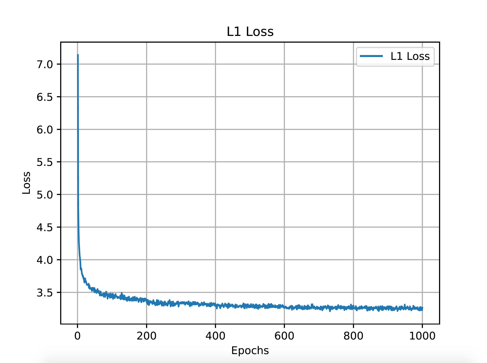
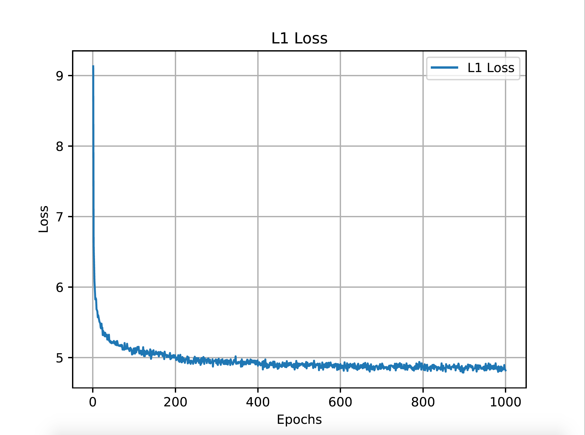
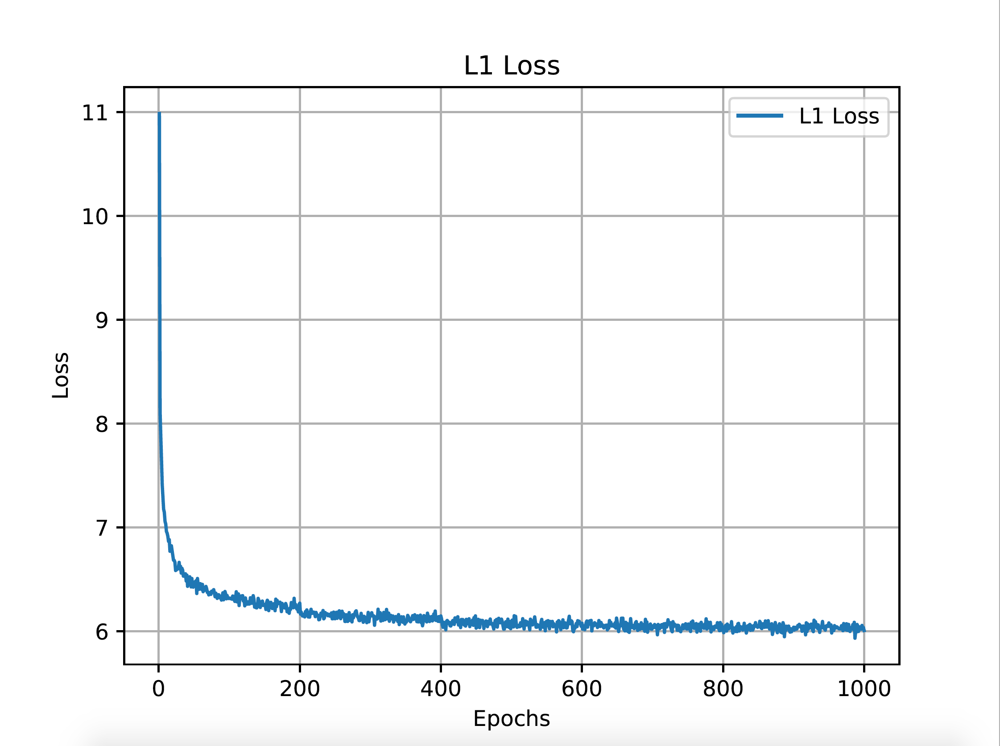

# MSRN_PyTorch
### This repository is an official PyTorch implementation of the paper "Multi-scale Residual Network for Image Super-Resolution".

Paper can be download from <a href="http://openaccess.thecvf.com/content_ECCV_2018/papers/Juncheng_Li_Multi-scale_Residual_Network_ECCV_2018_paper.pdf">MSRN</a> 

All reconstructed SR images can be downloaded from <a href="https://www.jianguoyun.com/p/DSc6bJcQ19ySBxiM_IUBf">here</a> .

All test datasets (HR images) can be downloaded from<a href="https://www.jianguoyun.com/p/DcrVSz0Q19ySBxiTs4oB">here</a>.

```
@InProceedings{Li_2018_ECCV,
author = {Li, Juncheng and Fang, Faming and Mei, Kangfu and Zhang, Guixu},
title = {Multi-scale Residual Network for Image Super-Resolution},
booktitle = {The European Conference on Computer Vision (ECCV)},
month = {September},
year = {2018}
}
```

Our MSRN was  trained and tested on the Y channel directly.
However, more and more SR models are trained on RGB channels.

For a fair comparison, we retrained MSRN based on <a href="https://github.com/thstkdgus35/EDSR-PyTorch">EDSR</a>  code.

We release the new codes and results on this project.

The old codes are moved into the OLD/ folder.

The new codes are stored on MSRN/ folder.

Now let's take a detailed introduction to the new codes.

```
cd MSRN/
```


## Prerequisites:
1. Python 3.6
2. PyTorch >= 0.4.0
3. numpy
4. skimage
5. imageio
6. matplotlib
7. tqdm

For more informaiton, please refer to <a href="https://github.com/thstkdgus35/EDSR-PyTorch">EDSR</a> and <a href="https://github.com/yulunzhang/RCAN">RCAN</a>.


## Document
Train/             : all train files

Test/              : all test files

demo.sh        : all running instructions


## Dataset
We used DIV2K dataset to train our model. Please download it from <a href="https://data.vision.ee.ethz.ch/cvl/DIV2K/">here</a>  or  <a href="https://cv.snu.ac.kr/research/EDSR/DIV2K.tar">SNU_CVLab</a>.

Extract the file and put it into the Train/dataset.


## Training

Use --ext sep_reset argument on your first running. 

You can skip the decoding part and use saved binaries with --ext sep argument in second time.
 
```
  cd Train/
  # MSRN x2  LR: 48 * 48  HR: 96 * 96
  python main.py --template MSRN --save MSRN_X2 --scale 2 --reset --save_results --patch_size 96 --ext sep_reset
  
  # MSRN x3  LR: 48 * 48  HR: 144 * 144
  python main.py --template MSRN --save MSRN_X3 --scale 3 --reset --save_results --patch_size 144 --ext sep_reset
  
  # MSRN x4  LR: 48 * 48  HR: 192 * 192
  python main.py --template MSRN --save MSRN_X4 --scale 4 --reset --save_results --patch_size 192 --ext sep_reset

```

## Testing
Using pre-trained model for training, all test datasets must be pretreatment by  Prepare_TestData_HR_LR.m and all pre-trained model should be put into Test/model/ first.

```
#MSRN x2
python main.py --data_test MyImage --scale 2 --model MSRN --pre_train ../model/MSRN_x2.pt --test_only --save_results --chop --save "MSRN" --testpath ../LR/LRBI --testset Set5

#MSRN+ x2
python main.py --data_test MyImage --scale 2 --model MSRN --pre_train ../model/MSRN_x2.pt --test_only --save_results --chop --self_ensemble --save "MSRN_plus" --testpath ../LR/LRBI --testset Set5


#MSRN x3
python main.py --data_test MyImage --scale 3 --model MSRN --pre_train ../model/MSRN_x3.pt --test_only --save_results --chop --save "MSRN" --testpath ../LR/LRBI --testset Set5

#MSRN+ x3
python main.py --data_test MyImage --scale 3 --model MSRN --pre_train ../model/MSRN_x3.pt --test_only --save_results --chop --self_ensemble --save "MSRN_plus" --testpath ../LR/LRBI --testset Set5


#MSRN x4
python main.py --data_test MyImage --scale 4 --model MSRN --pre_train ../model/MSRN_x4.pt --test_only --save_results --chop --save "MSRN" --testpath ../LR/LRBI --testset Set5

#MSRN+ x4
python main.py --data_test MyImage --scale 4 --model MSRN --pre_train ../model/MSRN_x4.pt --test_only --save_results --chop --self_ensemble --save "MSRN_plus" --testpath ../LR/LRBI --testset Set5
```

We also introduce self-ensemble strategy to improve our MSRN and denote the self-ensembled version as MSRN+.

More running instructions can be found in demo.sh.


## Performance

Our MSRN is trained on RGB, but as in previous work, we only reported PSNR/SSIM on the Y channel.

We use  Test/PSNR_SSIM_Results_BI_model.txt for PSRN/SSIM test.


Model|Scale|Set5|Set14|B100|Urban100|Manga109
--|:--:|:--:|:--:|:--:|:--:|:--:
old       |x2|38.08/0.9605|33.74/0.9170|32.23/0.9013|32.22/0.9326|38.82/0.9868
MSRN  |x2|38.08/0.9607|33.70/0.9186|32.23/0.9002|32.29/0.9303|38.69/0.9772
MSRN+|x2|38.15/0.9611|33.80/0.9192|32.28/0.9008|32.48/0.9318|38.93/0.9778
old       |x3|34.38/0.9262|30.34/0.8395|29.08/0.8041|28.08/0.8554|33.44/0.9427
MSRN  |x3|34.46/0.9278|30.41/0.8437|29.15/0.8064|28.33/0.8561|33.67/0.9456
MSRN+|x3|34.60/0.9286|30.52/0.8453|29.21/0.8075|28.51/0.8589|33.99/0.9473
old       |x4|32.07/0.8903|28.60/0.7751|27.52/0.7273|26.04/0.7896|30.17/0.9034
MSRN  |x4|32.26/0.8960|28.63/0.7836|27.61/0.7380|26.22/0.7911|30.57/0.9103
MSRN+|x4|32.40/0.8974|28.77/0.7860|27.69/0.7395|26.41/0.7952|30.93/0.9136


## Convergence Analyses

MSRN x2 on DIV2K training dataset.

<p align="center">

</p>

MSRN x3 on DIV2K training dataset.

<p align="center">
 
</p>

MSRN x4 on DIV2K training dataset.

<p align="center">

</p>


