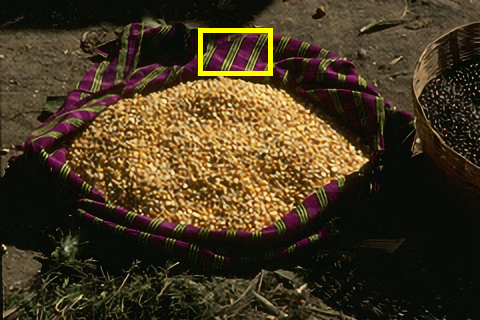
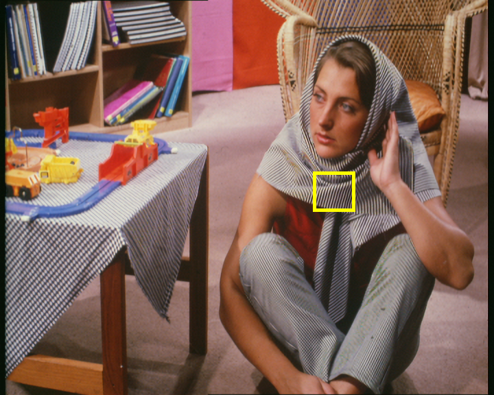

# MSRN_PyTorch
### This repository is a PyTorch version of the paper "Multi-scale Residual Network for Image Super-Resolution".

We propose a novel multi-scale residual network (MSRN) to fully exploit the image features, which performance exceeds most of the state-of-the-art SR methods. 
Based on the residual block, we introduce convolution kernels of different sizes to adaptively detect the image features at different scales. 
Meanwhile, we let these features interact with each other to get the most effective image information. 
This structure is called Multi-scale Residual Block (MSRB), which effectively extracts the features of the image. 
Furthermore, the outputs of each MSRB are used as the hierarchical features for global feature fusion. 
And then, all these features are sent to the reconstruction module for recovery of the high-quality image. 

      
     

### From left to right: Aplus, ProSRN, MSRN(our) and Original(GT)
---------------------

      
     

### From left to right: Aplus, ProSRN, MSRN(our) and Original(GT)
---------------------

## Prerequisites:
1. Linux
2. Python 3.5
3. PyTorch
3. CPU or NVIDIA GPU + CUDA CuDNN (CUDA 8.0)
 
   
## Demo using pre-trained model (x2)
	python test.py --cuda

    This is just a test demo for x2.
    The final trained model (x2,x3,x4,x8) will be released soon.

## Training
	Training files will be released soon.
## Testing
	python test.py --cuda   

## Dataset
Complete training and testing datasets will be released soon.
